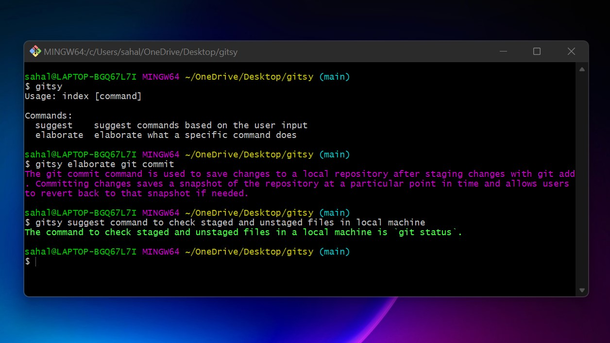

# Bring Your Terminal to Life!

Remember the last time your forgot the name of a particular command while using your command line even though you know exactly what that specific command does? Let's reverse the circumstances, try to remember the last time you recalled the name of a command but you werent able to remember what that command is for. Naturally all these circumstances leads poeple like us to require the help of our browsers or leave the command line frustrated in the worst case. But what if you get to access all the commands and their functionalities straight from the command line with the help of an assistant? That means you don't need to leave the command line ever again. Well Gitwiz just does all of that! Gitwiz is an AI terminal assistant which is created using GPT-3 and Node.js. Consider this as AI terminal helper, ready to assist you anytime you want. All you have to do is just type the following in your terminal:

## npm install gitwiz
