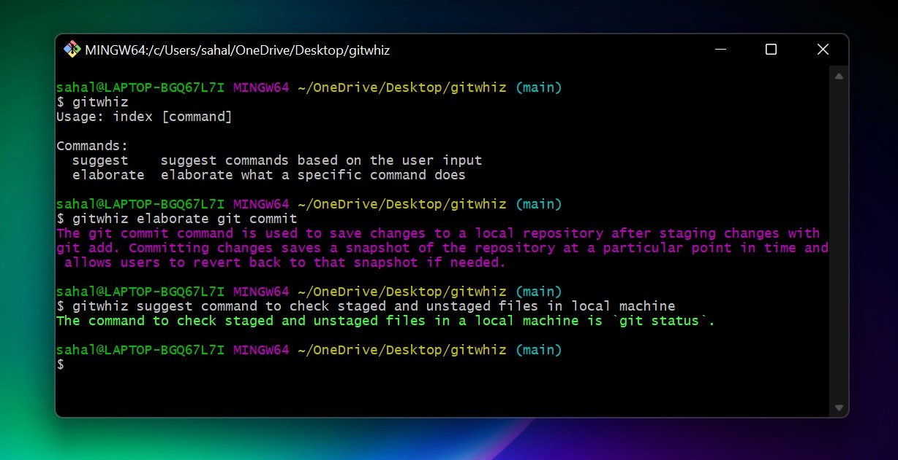

# Bring Your Terminal to Life!

Gitwhiz is an AI terminal assistant that makes using the command line easier than ever before. With the help of GPT-3 and Node.js, users can access all commands and their functionalities directly from the command line without ever having to leave. No more frustration when you can't remember a command or its purpose - just type in the command and Gitwhiz will provide you with all the information you need. Say goodbye to spending time searching through your browser for the right command - Gitwhiz is here to give you all the help you need!

Install Gitwhiz in three easy steps:

1. Visit the [OpenAI](https://openai.com/) website and create an account. Generate your API key by navigating to the API Keys page in your account settings.
2. Set the API key as an environment variable with the helf of the following command: `export OPEN_API_KEY=<YOUR_API_KEY>`
3. Use npm to install Gitwhiz with the command: `npm i gitwhiz`

And you're ready to get started, no more fearing the command line with Gitwhiz!
